# 🌲 Дерево рецептов Minecraft

> Структура прогрессии рецептов по тирам.

## 📊 Схема (Mermaid)

```mermaid
graph LR
  node_11["[Tier 0] ✨ Archipelago<br/><code>air</code>"]
  node_12["[Tier 3] ⛏️ Copper Pickaxe<br/><code>copper_pickaxe</code>"]
  node_13["[Tier 4] ⛏️ Iron Pickaxe<br/><code>iron_pickaxe</code>"]
  node_14["[Tier 5] ⛏️ Golden Pickaxe<br/><code>golden_pickaxe</code>"]
  node_15["[Tier 6] ⛏️ Diamond Pickaxe<br/><code>diamond_pickaxe</code>"]
  node_16["[Tier 7] ⛏️ Netherite Pickaxe<br/><code>netherite_pickaxe</code>"]
  node_17["[Tier 3] 🪙 Iron Ingot<br/><code>iron_ingot</code>"]
  node_18["[Tier 2] ✨ Stone Hoe<br/><code>stone_hoe</code>"]
  node_22["[Tier 3] ✨ Copper Hoe<br/><code>copper_hoe</code>"]
  node_23["[Tier 5] 🥇 Golden Hoe<br/><code>golden_hoe</code>"]
  node_24["[Tier 6] 💎 Diamond Hoe<br/><code>diamond_hoe</code>"]
  node_25["[Tier 4] 🪙 Iron Hoe<br/><code>iron_hoe</code>"]
  node_26["[Tier 7] ⬛ Netherite Hoe<br/><code>netherite_hoe</code>"]
  node_36["[Tier 3] 🗡️ Copper Axe<br/><code>copper_axe</code>"]
  node_37["[Tier 6] 🗡️ Diamond Axe<br/><code>diamond_axe</code>"]
  node_38["[Tier 5] 🗡️ Golden Axe<br/><code>golden_axe</code>"]
  node_39["[Tier 4] 🗡️ Iron Axe<br/><code>iron_axe</code>"]
  node_40["[Tier 7] 🗡️ Netherite Axe<br/><code>netherite_axe</code>"]
  node_47["[Tier 3] ✨ Copper Shovel<br/><code>copper_shovel</code>"]
  node_48["[Tier 6] 💎 Diamond Shovel<br/><code>diamond_shovel</code>"]
  node_49["[Tier 5] 🥇 Golden Shovel<br/><code>golden_shovel</code>"]
  node_50["[Tier 4] 🪙 Iron Shovel<br/><code>iron_shovel</code>"]
  node_51["[Tier 7] ⬛ Netherite Shovel<br/><code>netherite_shovel</code>"]
  node_57["[Tier 3] 🗡️ Copper Sword<br/><code>copper_sword</code>"]
  node_58["[Tier 6] 🗡️ Diamond Sword<br/><code>diamond_sword</code>"]
  node_59["[Tier 5] 🗡️ Golden Sword<br/><code>golden_sword</code>"]
  node_60["[Tier 4] 🗡️ Iron Sword<br/><code>iron_sword</code>"]
  node_61["[Tier 7] 🗡️ Netherite Sword<br/><code>netherite_sword</code>"]
  node_62["[Tier 2] 🗡️ Stone Sword<br/><code>stone_sword</code>"]
  node_70["[Tier 2] 🔥 Furnace<br/><code>furnace</code>"]
  node_71["[Tier 5] 🔥 Blast Furnace<br/><code>blast_furnace</code>"]
  node_74["[Tier 4] ✨ Blaze Powder<br/><code>blaze_powder</code>"]
  node_75["[Tier 3] ✨ Bow<br/><code>bow</code>"]
  node_76["[Tier 5] ✨ Crossbow<br/><code>crossbow</code>"]
  node_77["[Tier 4] ✨ Smoker<br/><code>smoker</code>"]
  node_81["[Tier 4] ✨ Boats<br/><code>acacia_boat</code>"]
  node_83["[Tier 1] 🪵 Wooden Sword<br/><code>wooden_sword</code>"]
  node_86["[Tier 1] 🪵 Wooden Hoe<br/><code>wooden_hoe</code>"]
  node_89["[Tier 1] 🪵 Wooden Spear<br/><code>wooden_spear</code>"]
  node_90["[Tier 2] ✨ Stone Spear<br/><code>stone_spear</code>"]
  node_91["[Tier 3] ✨ Copper Spear<br/><code>copper_spear</code>"]
  node_92["[Tier 4] 🪙 Iron Spear<br/><code>iron_spear</code>"]
  node_93["[Tier 5] 🥇 Golden Spear<br/><code>golden_spear</code>"]
  node_94["[Tier 6] 💎 Diamond Spear<br/><code>diamond_spear</code>"]
  node_95["[Tier 7] ⬛ Netherite Spear<br/><code>netherite_spear</code>"]
  node_103["[Tier 4] ✨ Shears<br/><code>shears</code>"]
  node_105["[Tier 6] ✨ Flint And Steel<br/><code>flint_and_steel</code>"]
  node_107["[Tier 6] ✨ Bucket<br/><code>bucket</code>"]
  node_109["[Tier 2] ✨ Fishing Rod<br/><code>fishing_rod</code>"]
  node_111["[Tier 4] ✨ Minecart<br/><code>minecart</code>"]
  node_114["[Tier 1] ✨ Doors, Trapdoors and Fence Gates<br/><code>acacia_door</code>"]
  node_116["[Tier 6] 📦 Enchanting Table<br/><code>enchanting_table</code>"]
  node_121["[Tier 7] ✨ Ender Eye<br/><code>ender_eye</code>"]
  node_123["[Tier 4] ✨ Shield<br/><code>shield</code>"]
  node_126["[Tier 3] ✨ Copper Helmet<br/><code>copper_helmet</code>"]
  node_127["[Tier 6] 💎 Diamond Helmet<br/><code>diamond_helmet</code>"]
  node_128["[Tier 5] 🥇 Golden Helmet<br/><code>golden_helmet</code>"]
  node_129["[Tier 4] 🪙 Iron Helmet<br/><code>iron_helmet</code>"]
  node_130["[Tier 2] ✨ Leather Helmet<br/><code>leather_helmet</code>"]
  node_131["[Tier 7] ⬛ Netherite Helmet<br/><code>netherite_helmet</code>"]
  node_146["[Tier 3] 📦 Copper Chestplate<br/><code>copper_chestplate</code>"]
  node_147["[Tier 6] 📦 Diamond Chestplate<br/><code>diamond_chestplate</code>"]
  node_148["[Tier 5] 📦 Golden Chestplate<br/><code>golden_chestplate</code>"]
  node_149["[Tier 4] 📦 Iron Chestplate<br/><code>iron_chestplate</code>"]
  node_150["[Tier 2] 📦 Leather Chestplate<br/><code>leather_chestplate</code>"]
  node_151["[Tier 7] 📦 Netherite Chestplate<br/><code>netherite_chestplate</code>"]
  node_158["[Tier 3] ✨ Copper Leggings<br/><code>copper_leggings</code>"]
  node_159["[Tier 6] 💎 Diamond Leggings<br/><code>diamond_leggings</code>"]
  node_160["[Tier 5] 🥇 Golden Leggings<br/><code>golden_leggings</code>"]
  node_161["[Tier 4] 🪙 Iron Leggings<br/><code>iron_leggings</code>"]
  node_162["[Tier 2] ✨ Leather Leggings<br/><code>leather_leggings</code>"]
  node_163["[Tier 7] ⬛ Netherite Leggings<br/><code>netherite_leggings</code>"]
  node_165["[Tier 3] ✨ Copper Boots<br/><code>copper_boots</code>"]
  node_166["[Tier 6] 💎 Diamond Boots<br/><code>diamond_boots</code>"]
  node_167["[Tier 5] 🥇 Golden Boots<br/><code>golden_boots</code>"]
  node_168["[Tier 4] 🪙 Iron Boots<br/><code>iron_boots</code>"]
  node_169["[Tier 2] ✨ Leather Boots<br/><code>leather_boots</code>"]
  node_170["[Tier 7] ⬛ Netherite Boots<br/><code>netherite_boots</code>"]
  node_186["[Tier 0] ✨ HP<br/><code>air</code>"]
  node_187["[Tier 0] ✨ HP<br/><code>air</code>"]
  node_188["[Tier 0] ✨ HP<br/><code>air</code>"]
  node_189["[Tier 0] ✨ HP<br/><code>air</code>"]
  node_190["[Tier 0] ✨ HP<br/><code>air</code>"]
  node_191["[Tier 0] ✨ HP<br/><code>air</code>"]
  node_192["[Tier 0] ✨ HP<br/><code>air</code>"]
  node_204["[Tier 0] ✨ Hunger<br/><code>air</code>"]
  node_205["[Tier 0] ✨ Hunger<br/><code>air</code>"]
  node_206["[Tier 0] ✨ Hunger<br/><code>air</code>"]
  node_207["[Tier 0] ✨ Hunger<br/><code>air</code>"]
  node_212["[Tier 0] ✨ Hunger<br/><code>air</code>"]
  node_213["[Tier 0] ✨ Hunger<br/><code>air</code>"]
  node_216["[Tier 0] ✨ Hand Length<br/><code>air</code>"]
  node_217["[Tier 0] ✨ Hand Length<br/><code>air</code>"]
  node_218["[Tier 0] ✨ Hand Length<br/><code>air</code>"]
  node_222["[Tier 0] ✨ World Border<br/><code>air</code>"]
  node_223["[Tier 0] ✨ World Border<br/><code>air</code>"]
  node_224["[Tier 0] ✨ World Border<br/><code>air</code>"]
  node_225["[Tier 0] ✨ World Border<br/><code>air</code>"]
  node_226["[Tier 0] ✨ World Border<br/><code>air</code>"]
  node_232["[Tier 0] ✨ Village<br/><code>air</code>"]
  node_233["[Tier 0] ✨ Ocean Monument<br/><code>air</code>"]
  node_234["[Tier 0] ✨ Bastion<br/><code>air</code>"]
  node_235["[Tier 0] ✨ Fortress<br/><code>air</code>"]
  node_236["[Tier 0] ✨ Pillager Outpost<br/><code>air</code>"]
  node_237["[Tier 0] ✨ Ancient City<br/><code>air</code>"]
  node_238["[Tier 0] ✨ Trial Chambers<br/><code>air</code>"]
  node_239["[Tier 0] ✨ End City<br/><code>air</code>"]
  node_240["[Tier 0] ✨ Inventory Slot<br/><code>air</code>"]
  node_241["[Tier 0] ✨ Inventory Slot 27<br/><code>air</code>"]
  node_242["[Tier 0] ✨ Inventory Slot<br/><code>air</code>"]
  node_245["[Tier 0] ✨ Second Hand<br/><code>air</code>"]
  node_260["[Tier 5] ✨ Disable Light Check for Monster Spawn<br/><code>air</code>"]
  node_261["[Tier 5] ✨ Disable Day Monster Ignition<br/><code>air</code>"]
  node_11 --> node_12
  node_11 --> node_17
  node_18 --> node_22
  node_22 --> node_25
  node_25 --> node_23
  node_23 --> node_24
  node_24 --> node_26
  node_15 --> node_16
  node_14 --> node_15
  node_13 --> node_14
  node_11 --> node_36
  node_39 --> node_38
  node_38 --> node_37
  node_37 --> node_40
  node_11 --> node_47
  node_50 --> node_49
  node_49 --> node_48
  node_48 --> node_51
  node_62 --> node_57
  node_60 --> node_59
  node_59 --> node_58
  node_58 --> node_61
  node_70 --> node_71
  node_11 --> node_70
  node_70 --> node_77
  node_75 --> node_76
  node_11 --> node_75
  node_11 --> node_81
  node_11 --> node_83
  node_83 --> node_62
  node_86 --> node_18
  node_11 --> node_86
  node_11 --> node_89
  node_89 --> node_90
  node_90 --> node_91
  node_92 --> node_93
  node_93 --> node_94
  node_94 --> node_95
  node_17 --> node_103
  node_11 --> node_105
  node_11 --> node_107
  node_11 --> node_109
  node_17 --> node_111
  node_11 --> node_114
  node_11 --> node_116
  node_11 --> node_74
  node_74 --> node_121
  node_36 --> node_39
  node_47 --> node_50
  node_57 --> node_60
  node_91 --> node_92
  node_12 --> node_13
  node_17 --> node_123
  node_130 --> node_126
  node_126 --> node_129
  node_129 --> node_128
  node_128 --> node_127
  node_127 --> node_131
  node_150 --> node_146
  node_146 --> node_149
  node_149 --> node_148
  node_148 --> node_147
  node_147 --> node_151
  node_162 --> node_158
  node_158 --> node_161
  node_161 --> node_160
  node_160 --> node_159
  node_159 --> node_163
  node_169 --> node_165
  node_165 --> node_168
  node_168 --> node_167
  node_167 --> node_166
  node_166 --> node_170
  node_11 --> node_130
  node_11 --> node_162
  node_11 --> node_150
  node_11 --> node_169
  node_186 --> node_187
  node_187 --> node_188
  node_188 --> node_191
  node_191 --> node_190
  node_190 --> node_189
  node_189 --> node_192
  node_11 --> node_186
  node_204 --> node_207
  node_207 --> node_205
  node_205 --> node_206
  node_11 --> node_204
  node_206 --> node_213
  node_213 --> node_212
  node_11 --> node_216
  node_216 --> node_218
  node_218 --> node_217
  node_222 --> node_226
  node_226 --> node_224
  node_224 --> node_225
  node_225 --> node_223
  node_11 --> node_222
  node_240 --> node_242
  node_242 --> node_241
  node_232 --> node_236
  node_236 --> node_235
  node_235 --> node_234
  node_234 --> node_238
  node_238 --> node_237
  node_237 --> node_233
  node_233 --> node_239
  node_11 --> node_232
  node_11 --> node_245
  node_11 --> node_240
  node_11 --> node_261
  node_11 --> node_260
```

## 📋 Список рецептов по Тирам

| Тир | Название | Предмет (misode) | Открываемые крафты |
| :---: | :--- | :--- | :--- |
| **0** | ✨ Archipelago | `minecraft:air` | `minecraft:cobblestone` |
| **0** | ✨ HP | `minecraft:air` | `minecraft:air` |
| **0** | ✨ HP | `minecraft:air` | `minecraft:air` |
| **0** | ✨ HP | `minecraft:air` | `minecraft:air` |
| **0** | ✨ HP | `minecraft:air` | `minecraft:air` |
| **0** | ✨ HP | `minecraft:air` | `minecraft:air` |
| **0** | ✨ HP | `minecraft:air` | `minecraft:air` |
| **0** | ✨ HP | `minecraft:air` | `minecraft:air` |
| **0** | ✨ Hunger | `minecraft:air` | `minecraft:air` |
| **0** | ✨ Hunger | `minecraft:air` | `minecraft:air` |
| **0** | ✨ Hunger | `minecraft:air` | `minecraft:air` |
| **0** | ✨ Hunger | `minecraft:air` | `minecraft:air` |
| **0** | ✨ Hunger | `minecraft:air` | `minecraft:air` |
| **0** | ✨ Hunger | `minecraft:air` | `minecraft:air` |
| **0** | ✨ Hand Length | `minecraft:air` | `minecraft:air` |
| **0** | ✨ Hand Length | `minecraft:air` | `minecraft:air` |
| **0** | ✨ Hand Length | `minecraft:air` | `minecraft:air` |
| **0** | ✨ World Border | `minecraft:air` | `minecraft:air` |
| **0** | ✨ World Border | `minecraft:air` | `minecraft:air` |
| **0** | ✨ World Border | `minecraft:air` | `minecraft:air` |
| **0** | ✨ World Border | `minecraft:air` | `minecraft:air` |
| **0** | ✨ World Border | `minecraft:air` | `minecraft:air` |
| **0** | ✨ Village | `minecraft:air` | `minecraft:air` |
| **0** | ✨ Ocean Monument | `minecraft:air` | `minecraft:air` |
| **0** | ✨ Bastion | `minecraft:air` | `minecraft:air` |
| **0** | ✨ Fortress | `minecraft:air` | `minecraft:air` |
| **0** | ✨ Pillager Outpost | `minecraft:air` | `minecraft:air` |
| **0** | ✨ Ancient City | `minecraft:air` | `minecraft:air` |
| **0** | ✨ Trial Chambers | `minecraft:air` | `minecraft:air` |
| **0** | ✨ End City | `minecraft:air` | `minecraft:air` |
| **0** | ✨ Inventory Slot | `minecraft:air` | `minecraft:air` |
| **0** | ✨ Inventory Slot 27 | `minecraft:air` | `minecraft:air` |
| **0** | ✨ Inventory Slot | `minecraft:air` | `minecraft:air` |
| **0** | ✨ Second Hand | `minecraft:air` | `minecraft:air` |
| **1** | 🪵 Wooden Sword | `minecraft:wooden_sword` | `minecraft:wooden_sword` |
| **1** | 🪵 Wooden Hoe | `minecraft:wooden_hoe` | `minecraft:wooden_hoe` |
| **1** | 🪵 Wooden Spear | `minecraft:wooden_spear` | `minecraft:wooden_spear` |
| **1** | ✨ Doors and Trapdoors | `minecraft:acacia_door` | `minecraft:acacia_door`, `minecraft:acacia_trapdoor`, `minecraft:bamboo_door`, `minecraft:bamboo_trapdoor`, `minecraft:birch_door`, `minecraft:birch_trapdoor`, `minecraft:cherry_door`, `minecraft:cherry_trapdoor`, `minecraft:copper_door`, `minecraft:copper_trapdoor`, `minecraft:dark_oak_door`, `minecraft:dark_oak_trapdoor`, `minecraft:exposed_copper_door`, `minecraft:exposed_copper_trapdoor`, `minecraft:jungle_door`, `minecraft:jungle_trapdoor`, `minecraft:mangrove_door`, `minecraft:mangrove_trapdoor`, `minecraft:oak_door`, `minecraft:oak_trapdoor`, `minecraft:oxidized_copper_door`, `minecraft:oxidized_copper_trapdoor`, `minecraft:waxed_oxidized_copper_door`, `minecraft:waxed_oxidized_copper_trapdoor`, `minecraft:pale_oak_door`, `minecraft:pale_oak_trapdoor`, `minecraft:poplar_door`, `minecraft:poplar_trapdoor`, `minecraft:spruce_door`, `minecraft:spruce_trapdoor`, `minecraft:waxed_weathered_copper_door`, `minecraft:waxed_weathered_copper_trapdoor`, `minecraft:weathered_copper_door`, `minecraft:weathered_copper_trapdoor` |
| **2** | ✨ Stone Hoe | `minecraft:stone_hoe` | `minecraft:stone_hoe` |
| **2** | 🗡️ Stone Sword | `minecraft:stone_sword` | `minecraft:stone_sword` |
| **2** | 🔥 Furnace | `minecraft:furnace` | `minecraft:furnace` |
| **2** | ✨ Stone Spear | `minecraft:stone_spear` | `minecraft:stone_spear` |
| **2** | ✨ Fishing Rod | `minecraft:fishing_rod` | `minecraft:fishing_rod` |
| **2** | ✨ Leather Helmet | `minecraft:leather_helmet` | `minecraft:leather_helmet` |
| **2** | 📦 Leather Chestplate | `minecraft:leather_chestplate` | `minecraft:leather_chestplate` |
| **2** | ✨ Leather Leggings | `minecraft:leather_leggings` | `minecraft:leather_leggings` |
| **2** | ✨ Leather Boots | `minecraft:leather_boots` | `minecraft:leather_boots` |
| **3** | ⛏️ Copper Pickaxe | `minecraft:copper_pickaxe` | `minecraft:copper_pickaxe` |
| **3** | 🪙 Iron Ingot | `minecraft:iron_ingot` | `minecraft:iron_ingot` |
| **3** | ✨ Copper Hoe | `minecraft:copper_hoe` | `minecraft:copper_hoe` |
| **3** | 🗡️ Copper Axe | `minecraft:copper_axe` | `minecraft:copper_axe` |
| **3** | ✨ Copper Shovel | `minecraft:copper_shovel` | `minecraft:copper_shovel` |
| **3** | 🗡️ Copper Sword | `minecraft:copper_sword` | `minecraft:copper_sword` |
| **3** | ✨ Bow | `minecraft:bow` | `minecraft:bow` |
| **3** | ✨ Copper Spear | `minecraft:copper_spear` | `minecraft:copper_spear` |
| **3** | ✨ Copper Helmet | `minecraft:copper_helmet` | `minecraft:copper_helmet` |
| **3** | 📦 Copper Chestplate | `minecraft:copper_chestplate` | `minecraft:copper_chestplate` |
| **3** | ✨ Copper Leggings | `minecraft:copper_leggings` | `minecraft:copper_leggings` |
| **3** | ✨ Copper Boots | `minecraft:copper_boots` | `minecraft:copper_boots` |
| **4** | ⛏️ Iron Pickaxe | `minecraft:iron_pickaxe` | `minecraft:iron_pickaxe` |
| **4** | 🪙 Iron Hoe | `minecraft:iron_hoe` | `minecraft:iron_hoe` |
| **4** | 🗡️ Iron Axe | `minecraft:iron_axe` | `minecraft:iron_axe` |
| **4** | 🪙 Iron Shovel | `minecraft:iron_shovel` | `minecraft:iron_shovel` |
| **4** | 🗡️ Iron Sword | `minecraft:iron_sword` | `minecraft:iron_sword` |
| **4** | ✨ Blaze Powder | `minecraft:blaze_powder` | `minecraft:blaze_powder` |
| **4** | ✨ Smoker | `minecraft:smoker` | `minecraft:smoker` |
| **4** | ✨ Boats | `minecraft:acacia_boat` | `minecraft:acacia_boat`, `minecraft:birch_boat`, `minecraft:cherry_boat`, `minecraft:dark_oak_boat`, `minecraft:jungle_boat`, `minecraft:mangrove_boat`, `minecraft:oak_boat`, `minecraft:pale_oak_boat`, `minecraft:poplar_boat`, `minecraft:spruce_boat` |
| **4** | 🪙 Iron Spear | `minecraft:iron_spear` | `minecraft:iron_spear` |
| **4** | ✨ Shears | `minecraft:shears` | `minecraft:shears` |
| **4** | ✨ Minecart | `minecraft:minecart` | `minecraft:minecart` |
| **4** | ✨ Shield | `minecraft:shield` | `minecraft:shield` |
| **4** | 🪙 Iron Helmet | `minecraft:iron_helmet` | `minecraft:iron_helmet`, `minecraft:chainmail_helmet` |
| **4** | 📦 Iron Chestplate | `minecraft:iron_chestplate` | `minecraft:iron_chestplate`, `minecraft:chainmail_chestplate` |
| **4** | 🪙 Iron Leggings | `minecraft:iron_leggings` | `minecraft:iron_leggings`, `minecraft:chainmail_leggings` |
| **4** | 🪙 Iron Boots | `minecraft:iron_boots` | `minecraft:iron_boots`, `minecraft:chainmail_boots` |
| **5** | ⛏️ Golden Pickaxe | `minecraft:golden_pickaxe` | `minecraft:golden_pickaxe` |
| **5** | 🥇 Golden Hoe | `minecraft:golden_hoe` | `minecraft:golden_hoe` |
| **5** | 🗡️ Golden Axe | `minecraft:golden_axe` | `minecraft:golden_axe` |
| **5** | 🥇 Golden Shovel | `minecraft:golden_shovel` | `minecraft:golden_shovel` |
| **5** | 🗡️ Golden Sword | `minecraft:golden_sword` | `minecraft:golden_sword` |
| **5** | 🔥 Blast Furnace | `minecraft:blast_furnace` | `minecraft:blast_furnace` |
| **5** | ✨ Crossbow | `minecraft:crossbow` | `minecraft:crossbow` |
| **5** | 🥇 Golden Spear | `minecraft:golden_spear` | `minecraft:golden_spear` |
| **5** | 🥇 Golden Helmet | `minecraft:golden_helmet` | `minecraft:golden_helmet` |
| **5** | 📦 Golden Chestplate | `minecraft:golden_chestplate` | `minecraft:golden_chestplate` |
| **5** | 🥇 Golden Leggings | `minecraft:golden_leggings` | `minecraft:golden_leggings` |
| **5** | 🥇 Golden Boots | `minecraft:golden_boots` | `minecraft:golden_boots` |
| **5** | ✨ Disable Light Check for Monster Spawn | `minecraft:air` | `minecraft:air` |
| **5** | ✨ Disable Day Monster Ignition | `minecraft:air` | `minecraft:air` |
| **6** | ⛏️ Diamond Pickaxe | `minecraft:diamond_pickaxe` | `minecraft:diamond_pickaxe` |
| **6** | 💎 Diamond Hoe | `minecraft:diamond_hoe` | `minecraft:diamond_hoe` |
| **6** | 🗡️ Diamond Axe | `minecraft:diamond_axe` | `minecraft:diamond_axe` |
| **6** | 💎 Diamond Shovel | `minecraft:diamond_shovel` | `minecraft:diamond_shovel` |
| **6** | 🗡️ Diamond Sword | `minecraft:diamond_sword` | `minecraft:diamond_sword` |
| **6** | 💎 Diamond Spear | `minecraft:diamond_spear` | `minecraft:diamond_spear` |
| **6** | ✨ Flint And Steel | `minecraft:flint_and_steel` | `minecraft:flint_and_steel` |
| **6** | ✨ Bucket | `minecraft:bucket` | `minecraft:bucket` |
| **6** | 📦 Enchanting Table | `minecraft:enchanting_table` | `minecraft:enchanting_table` |
| **6** | 💎 Diamond Helmet | `minecraft:diamond_helmet` | `minecraft:diamond_helmet` |
| **6** | 📦 Diamond Chestplate | `minecraft:diamond_chestplate` | `minecraft:diamond_chestplate` |
| **6** | 💎 Diamond Leggings | `minecraft:diamond_leggings` | `minecraft:diamond_leggings` |
| **6** | 💎 Diamond Boots | `minecraft:diamond_boots` | `minecraft:diamond_boots` |
| **7** | ⛏️ Netherite Pickaxe | `minecraft:netherite_pickaxe` | `minecraft:netherite_pickaxe` |
| **7** | ⬛ Netherite Hoe | `minecraft:netherite_hoe` | `minecraft:netherite_hoe` |
| **7** | 🗡️ Netherite Axe | `minecraft:netherite_axe` | `minecraft:netherite_axe` |
| **7** | ⬛ Netherite Shovel | `minecraft:netherite_shovel` | `minecraft:netherite_shovel` |
| **7** | 🗡️ Netherite Sword | `minecraft:netherite_sword` | `minecraft:netherite_sword` |
| **7** | ⬛ Netherite Spear | `minecraft:netherite_spear` | `minecraft:netherite_spear` |
| **7** | ✨ Ender Eye | `minecraft:ender_eye` | `minecraft:ender_eye` |
| **7** | ⬛ Netherite Helmet | `minecraft:netherite_helmet` | `minecraft:netherite_helmet` |
| **7** | 📦 Netherite Chestplate | `minecraft:netherite_chestplate` | `minecraft:netherite_chestplate` |
| **7** | ⬛ Netherite Leggings | `minecraft:netherite_leggings` | `minecraft:netherite_leggings` |
| **7** | ⬛ Netherite Boots | `minecraft:netherite_boots` | `minecraft:netherite_boots` |

---
*Экспортировано из Minecraft Recipe Tree Studio*
